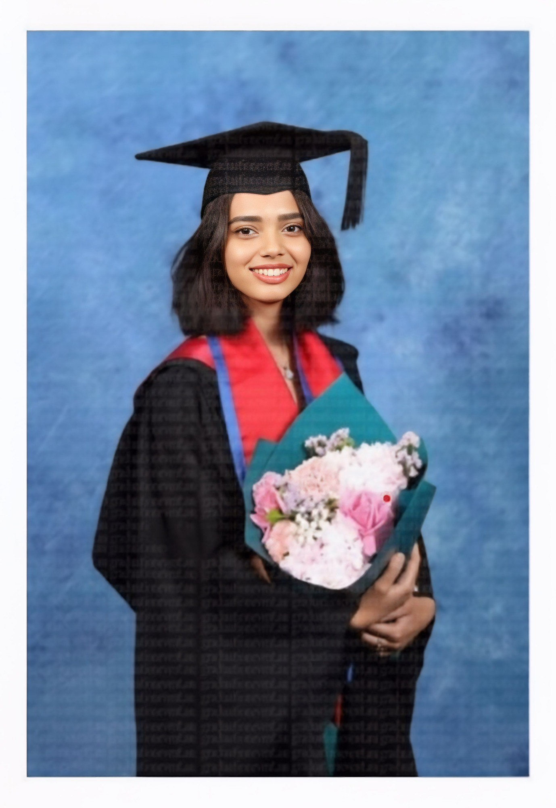
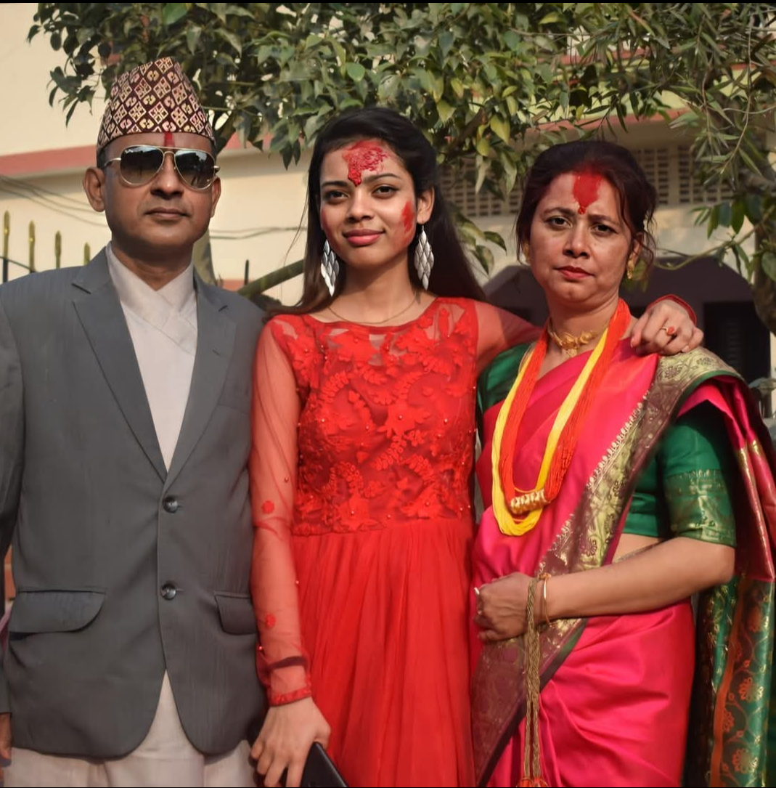
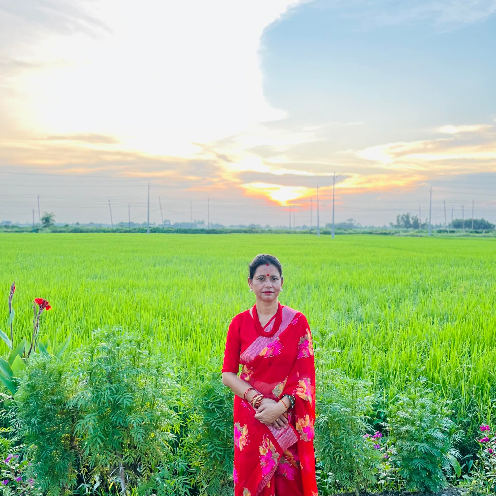

<!DOCTYPE html>
<html lang="en">
<head>
    <meta charset="UTF-8">
    <meta name="viewport" content="width=device-width, initial-scale=1.0">
    <title>For Prashna ❤️</title>
    
</head>
<body>

    <audio id="bgMusic" loop><source src="music.mp3" type="audio/mpeg"></audio>

    

        
        

            <h1>Dearest Prashna,</h1>
            
I built this garden of words for you because I wanted to speak from my heart without any more drama. You have always been the person who brought peace to my life, and I am truly sorry for the stress I have caused lately.

            
            
This is a place for us to remember the beautiful moments we shared, before the mistakes and the noise got in the way.

        

        

        

            
Our story began in April 2022 at Bupa. From those first shifts to the home we built in Flemington and Homebush West, you were my world. I cherish the memories of our Malatang dates and those winter nights sharing hot chocolate. I miss that quiet happiness every single day.

            
        

        

            
I look at this photo from August 4th and I see the light in your eyes that I was supposed to protect. I failed that responsibility.

            
            

                "I let other things become my priority. I didn't stand for you when you needed a partner you could count on. I am sorry for not being the man you deserved in those moments."
            

            
I miss our drives to Ulladulla, Jervis Bay, Wollongong, Port Macquarie, Coffs Harbour, and Armidale. Those long roads with you were the happiest I’ve ever been.

        

        

            <h1>To Your Mom, Dad & Family</h1>
            
I want to offer my deepest and most sincere apologies to your Mom and Dad. I failed the trust of your family and I am sorry for the pain I brought to your home. I have nothing but respect for all of you.

            

                
                
            

        

        

            <h1>My Hope for You</h1>
            
Prashna, I want you to be the most successful Registered Nurse. I want you to have the beautiful future and the daughter you've always dreamed of. You deserve a life full of love and success.

            
If you can find it in your heart to forgive me, I am ready to make you my only priority from this day forward.

            
            <button class="proposal-btn" onclick="showFinal()">Will you marry me?</button>

            

                
Prashna, let us start again.

                
I will never forget you. ❤️

                
— Always Yours, Pratham

            

        

        <footer>
            Forever in my heart, Prashna Kumari Aryal
        </footer>

    

    
</body>
</html>
